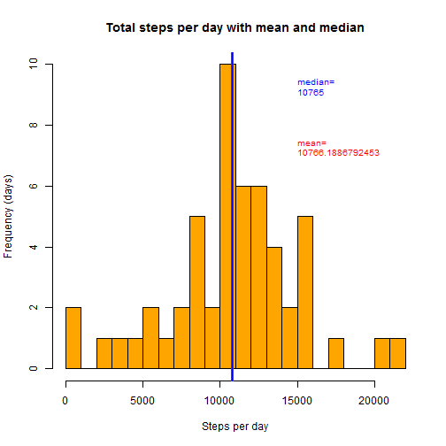

# REPORT - Personal activity

### Two months of data from a personal activity monitoring device

---
We use  data from a personal activity monitoring device. This device collects data at 5 minute intervals through out the day. The data consists of two months of data from an anonymous individual collected during the months of October and November, 2012 and include the number of steps taken in 5 minute intervals each day.


We need some additional packages:

```
library(dplyr)
library(ggplot2)
library(lattice)
```


```r
library(dplyr)
```

```
## 
## Attaching package: 'dplyr'
## 
## The following objects are masked from 'package:stats':
## 
##     filter, lag
## 
## The following objects are masked from 'package:base':
## 
##     intersect, setdiff, setequal, union
```

```r
library(ggplot2)
library(lattice) 
```


## Loading and preprocessing the data

The raw data can be downloaded from the web site:

* Dataset: [Activity monitoring data](https://d396qusza40orc.cloudfront.net/repdata%2Fdata%2Factivity.zip) [52K] 

or can be downloaded from this GitHub repository: 

* the file is [activity.zip](https://github.com/antomarc/RepData_PeerAssessment1/blob/master/activity.zip). 

Download the file in the working directory, unzip, read and store data in ```df```:


```r
unzip(zipfile = "activity.zip")

df <- read.csv("activity.csv",header=TRUE)
```


```r
df$date<-as.Date(df$date) # convert from factor to Date class
head(df,3)
```

```
##   steps       date interval
## 1    NA 2012-10-01        0
## 2    NA 2012-10-01        5
## 3    NA 2012-10-01       10
```

```r
str(df)
```

```
## 'data.frame':	17568 obs. of  3 variables:
##  $ steps   : int  NA NA NA NA NA NA NA NA NA NA ...
##  $ date    : Date, format: "2012-10-01" "2012-10-01" ...
##  $ interval: int  0 5 10 15 20 25 30 35 40 45 ...
```

```r
summary(df$steps)
```

```
##    Min. 1st Qu.  Median    Mean 3rd Qu.    Max.    NA's 
##    0.00    0.00    0.00   37.38   12.00  806.00    2304
```
We see that there are a total of 17 568 observations.

The variables are:

* steps: Number of steps taking in a 5-minute interval (missing values are coded as NA)

* date: The date on which the measurement was taken in YYYY-MM-DD format

* interval: Identifier for the 5-minute interval in which measurement was taken.


## What is mean total number of steps taken per day?

For this part, we can ignore the missing values in the dataset.

Calculate the total number of steps taken per day.


```r
d1<-na.omit(df)
d1<-summarize(group_by(d1,date),tot=sum(steps))
head(d1,3)
```

```
## Source: local data frame [3 x 2]
## 
##         date   tot
##       (date) (int)
## 1 2012-10-02   126
## 2 2012-10-03 11352
## 3 2012-10-04 12116
```

```r
summary(d1$tot)
```

```
##    Min. 1st Qu.  Median    Mean 3rd Qu.    Max. 
##      41    8841   10760   10770   13290   21190
```

We see the mean total number of steps taken per day.


Make a histogram of the total number of steps taken each day.


```r
hist(d1$tot,main="Total steps per day",xlab="Steps per day",ylab="Frequency (days)", col="orange",breaks=30)
```

 


Calculate and report the mean and median of the total number of steps taken per day.

**Mean:**

```r
M<-mean(d1$tot)
M
```

```
## [1] 10766.19
```

**Median:**

```r
Me<-median(d1$tot)
Me
```

```
## [1] 10765
```

We see mean and median:


```r
hist(d1$tot,main="Total steps per day with mean and median",
     xlab="Steps per day",ylab="Frequency (days)", col="orange",breaks=30)
abline(v=M,col="red",lwd=3)
abline(v=Me,col="blue",lwd=1)
text(15000, 9, labels=c("median=\n",Me),adj=c(0,0),col="blue",cex=0.8)
text(15000, 7, labels=c("mean=\n",M),adj=c(0,0),col="red",cex=0.8)
```

 

Zoom in:


```r
hist(d1$tot,main="Mean and median of total steps per day",
     xlab="Steps per day",ylab="Frequency (days)", col="orange",breaks=30,xlim=range(10760:10770))
abline(v=M,col="red",lwd=3) #MEAN
abline(v=Me,col="blue",lwd=1) #MEDIAN
text(10767,8,labels=c("median=\n",Me),adj=c(0,0),col="blue",cex=0.8)
text(10767,5,labels=c("mean=\n",M),adj=c(0,0),col="red",cex=0.8)
```

 


## What is the average daily activity pattern?

Make a time series plot of the 5-minute interval (x-axis) and the average number of steps taken, averaged across all days (y-axis):


```r
d2<-summarize(group_by(df,interval),steps=mean(steps,na.rm=TRUE))
str(d2)
```

```
## Classes 'tbl_df', 'tbl' and 'data.frame':	288 obs. of  2 variables:
##  $ interval: int  0 5 10 15 20 25 30 35 40 45 ...
##  $ steps   : num  1.717 0.3396 0.1321 0.1509 0.0755 ...
```

```r
summary(d2$steps)
```

```
##    Min. 1st Qu.  Median    Mean 3rd Qu.    Max. 
##   0.000   2.486  34.110  37.380  52.830 206.200
```

```r
plot(x=d2$interval,y=d2$steps,type="l",main="Daily activity (average)",xlab="5-minute intervals",ylab="Steps")
```

 


Which 5-minute interval, on average across all the days in the dataset, contains the maximum number of steps?

```r
best<-filter(d2,d2$step==max(d2$step))
best
```

```
## Source: local data frame [1 x 2]
## 
##   interval    steps
##      (int)    (dbl)
## 1      835 206.1698
```
The interval 835 (8 hour and 35 minutes = 8:35 AM) contains the maximum number of steps (206.1698 steps on average).


## Imputing missing values

Calculate and report the total number of missing values in the dataset (i.e. the total number of rows with NAs):


```r
dfna<-filter(df,is.na(df$steps))
nrow(dfna)
```

```
## [1] 2304
```

Devise a strategy for filling in all of the missing values in the dataset: we use the mean for that 5-minute interval, storage in ```d2```.
 
Create a new dataset ``` dff ``` that is equal to the original dataset ``` df ``` but with the missing data filled in:

```r
dff<-df

for(i in 1:nrow(dff)){
  if(is.na(dff$steps[i])){
    inter<-dff$interval[i]
    r<-filter(d2,d2$interval==inter)
    dff$steps[i]<-r$steps
  }
}

str(dff)
```

```
## 'data.frame':	17568 obs. of  3 variables:
##  $ steps   : num  1.717 0.3396 0.1321 0.1509 0.0755 ...
##  $ date    : Date, format: "2012-10-01" "2012-10-01" ...
##  $ interval: int  0 5 10 15 20 25 30 35 40 45 ...
```

Make a histogram of the total number of steps taken each day and calculate and report the mean and median total number of steps taken per day. 

```r
dff1<-summarize(group_by(dff,date),tot=sum(steps))
head(dff1,3)
```

```
## Source: local data frame [3 x 2]
## 
##         date      tot
##       (date)    (dbl)
## 1 2012-10-01 10766.19
## 2 2012-10-02   126.00
## 3 2012-10-03 11352.00
```

```r
Mff<-mean(dff1$tot)
Mff
```

```
## [1] 10766.19
```

```r
Meff<-median(dff1$tot)
Meff
```

```
## [1] 10766.19
```

```r
hist(dff1$tot,main="Total steps per day (imputing missing values)", 
     xlab="Steps per day",ylab="Frequency (days)", col="gold",breaks=30)
abline(v=Mff,col="red",lwd=3)
abline(v=Meff,col="blue",lwd=1)
text(15000,13,labels=c("median=\n",Meff),adj=c(0,0),col="blue",cex=0.8)
text(15000,10,labels=c("mean=\n",Mff),adj=c(0,0),col="red",cex=0.8)
```

 

```r
##zoom in:
hist(dff1$tot,main="Mean and median of total steps per day (imputing missing values)",
     xlab="Steps per day",ylab="Frequency (days)", col="gold",breaks=30,xlim=range(10760:10770))
abline(v=Mff,col="red",lwd=3) #MEAN
abline(v=Meff,col="blue",lwd=1) #MEDIAN
text(10767,8,labels=c("median=\n",Meff),adj=c(0,0),col="blue",cex=0.8)
text(10767,5,labels=c("mean=\n",Mff),adj=c(0,0),col="red",cex=0.8)
```

 

We compare mean value and median value to the estimates from the first part:

we see that the mean value is not changed, while the median value has increased (a small increase) and is equal to the mean value. 

What is the impact of imputing missing data on the estimates of the total daily number of steps?

Imputing 2304 missing data has increased the size of the statistical sample 
and then the frequency, but  does not change the estimates of the total daily number of steps.

```r
summary(d1$tot)  ## ignoring the missing values in the dataset
```

```
##    Min. 1st Qu.  Median    Mean 3rd Qu.    Max. 
##      41    8841   10760   10770   13290   21190
```

```r
summary(dff1$tot)  ## inputing missing data
```

```
##    Min. 1st Qu.  Median    Mean 3rd Qu.    Max. 
##      41    9819   10770   10770   12810   21190
```

## Are there differences in activity patterns between weekdays and weekends?
 
We use the dataset ``` dff ``` with the filled-in missing values for this part.

Create a new factor variable ``` de ``` in the dataset with two levels - "weekday" and "weekend" indicating whether a given date is a weekday or weekend day:


```r
dffw<-dff

Sys.setlocale("LC_TIME", "English") 
```

```
## [1] "English_United States.1252"
```

```r
dffw<-mutate(dffw,de=ifelse(weekdays(dffw$date)=="Sunday"|weekdays(dffw$date)=="Saturday","weekend","weekday"))

# equivalent:
# dffw<-mutate(dffw,de=ifelse(format(dffw$date,"%w")=="0"|format(dffw$date,"%w")=="7","weekend","weekday"))
head(dffw,3)
```

```
##       steps       date interval      de
## 1 1.7169811 2012-10-01        0 weekday
## 2 0.3396226 2012-10-01        5 weekday
## 3 0.1320755 2012-10-01       10 weekday
```


```r
## weekday:
wd<-filter(dffw,de=="weekday")
wd<-summarize(group_by(wd,interval),steps=mean(steps))
plot(x=wd$interval,y=wd$steps,type="l",main="Daily activity in a weekday (average)",
     xlab="5-minute intervals",ylab="Steps")
```

 

```r
## weekend:
we<-filter(dffw,de=="weekend")
we<-summarize(group_by(we,interval),steps=mean(steps))
plot(x=we$interval,y=we$steps,type="l",main="Daily activity in a weekend (average)",
     xlab="5-minute intervals",ylab="Steps")
```

 

Make a **panel plot** containing a time series plot (i.e. type = "l") of the 5-minute interval (x-axis) and the average number of steps taken, averaged across all weekday days or weekend days (y-axis): 

```r
a <- aggregate(dffw$steps,by=list(dffw$interval,dffw$de),mean)
names(a)<-c("interval","de","steps")
head(a,3)
```

```
##   interval      de     steps
## 1        0 weekday 2.2511530
## 2        5 weekday 0.4452830
## 3       10 weekday 0.1731656
```

```r
xyplot(steps~interval|de,data=a,layout=c(1,2),type = "l",main="Daily activity in a weekend (average)",xlab="Interval",ylab="Number of steps")
```

 
